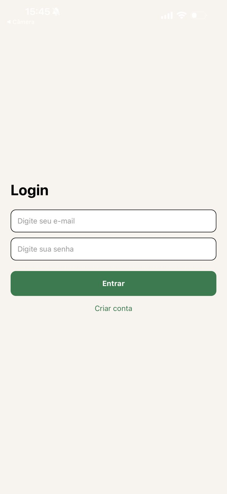
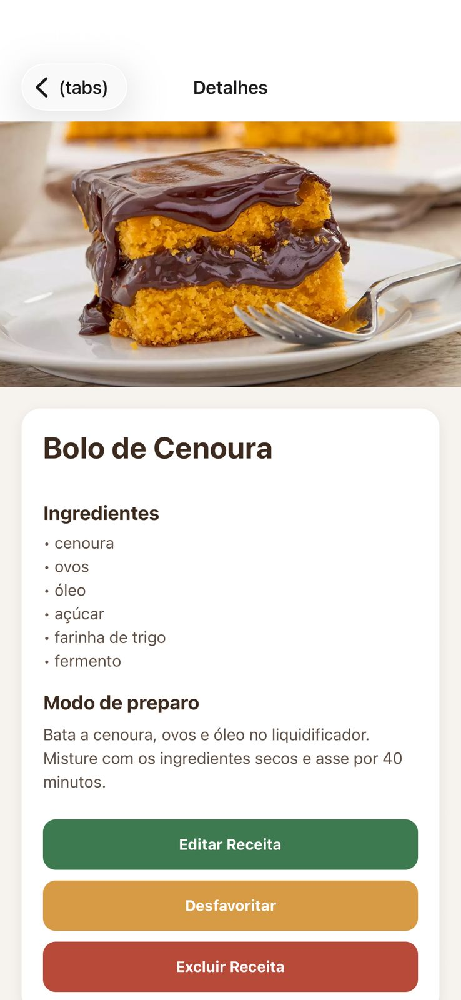
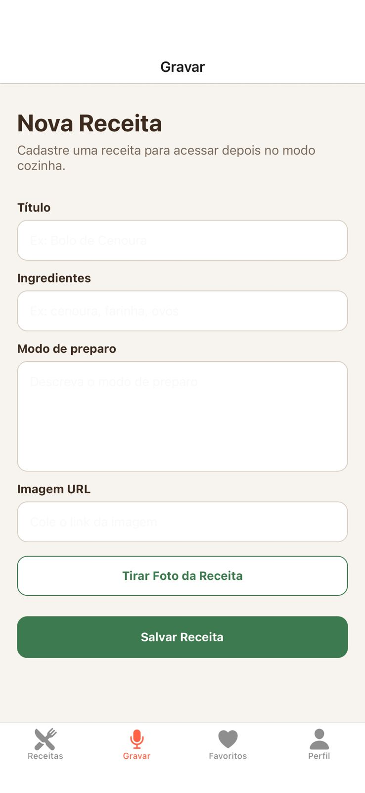
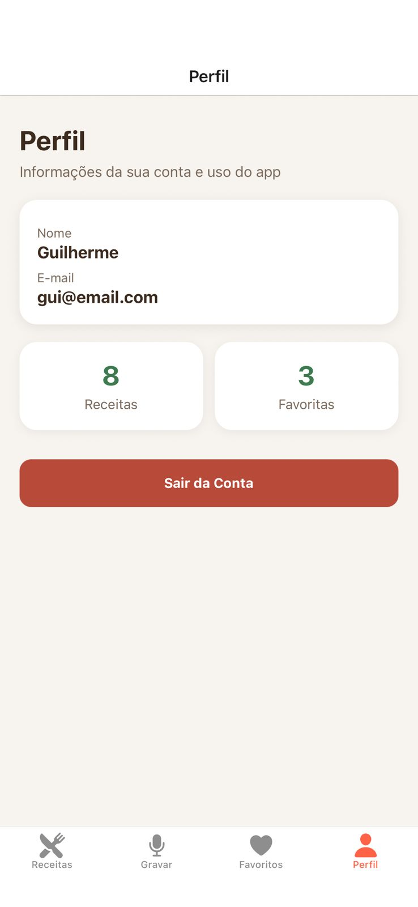

# 🍳 AudioCook


Aplicativo mobile desenvolvido em **React Native com Expo** para gerenciamento de receitas culinárias, com autenticação de usuários, persistência de sessão e uso de recursos nativos do dispositivo como câmera.

---

## 🎥 Demonstração

📺 Vídeo completo do funcionamento:

[Assistir demonstração](./assets/readme/videoreact.mp4)

---

## 📸 Telas do App

### 🔐 Login



### 🏠 Home


### 📄 Detalhes



### 📷 Gravar Receita



### 👤 Perfil



---

## 📱 Visão Geral

O **AudioCook** permite que usuários criem, visualizem, editem e organizem receitas de forma prática e intuitiva. O projeto foi desenvolvido com foco em **boas práticas de desenvolvimento**, incluindo separação de responsabilidades, uso de API REST e versionamento profissional com Git.

---

## 🚀 Funcionalidades

### 🔐 Autenticação

* Cadastro de usuários
* Login com validação
* Persistência de sessão com AsyncStorage
* Logout seguro

### 📖 Gestão de Receitas (CRUD)

* Criar receitas
* Listar receitas
* Visualizar detalhes
* Editar receitas
* Excluir receitas

### ⭐ Favoritos

* Marcar/desmarcar receitas como favoritas
* Visualização de receitas favoritas

### 👤 Perfil do Usuário

* Exibição de nome e e-mail
* Estatísticas:

  * Total de receitas
  * Total de favoritas
* Logout

### 📷 Integração com Câmera

* Captura de imagem diretamente pelo dispositivo
* Uso de imagens reais nas receitas

---

## 🧱 Arquitetura do Projeto

### Frontend (Mobile)

* React Native (Expo)
* Expo Router (navegação)
* AsyncStorage (persistência local)
* Axios (requisições HTTP)

### Backend (API)

* Node.js
* Express
* MongoDB (Mongoose)

---

## 🗂 Estrutura de Pastas

```bash
app/
├── (tabs)/
│   ├── _layout.tsx        # Navegação por abas
│   ├── index.tsx          # Home
│   ├── favoritos.tsx      # Favoritos
│   ├── gravar.tsx         # Criar receita (com câmera)
│   ├── perfil.tsx         # Perfil
│
├── login.tsx              # Login
├── cadastro.tsx           # Cadastro
├── detalhes.tsx           # Detalhes da receita
├── editar.tsx             # Edição
├── _layout.tsx            # Stack principal
├── index.tsx              # Redirecionamento inicial
```

---

## 🛠 Tecnologias Utilizadas

* React Native
* Expo
* Expo Router
* AsyncStorage
* Axios
* Node.js
* Express
* MongoDB
* Mongoose

---

## ⚙️ Como Executar o Projeto

### 1. Clonar o repositório

```bash
git clone https://github.com/Omestredodev/AudioCook.git
```

---

### 2. Backend

```bash
cd api-receitas
npm install
node server.js
```

---

### 3. Frontend

```bash
cd app-receitas
npx expo install
npx expo start
```

Abra no seu dispositivo com o **Expo Go**.

---

## 🔐 API Endpoints

### Usuário

* `POST /cadastro`
* `POST /login`

### Receitas

* `GET /receitas`
* `GET /receitas/:id`
* `POST /receitas`
* `PUT /receitas/:id`
* `DELETE /receitas/:id`

---

## 🧠 Conceitos Aplicados

* Arquitetura cliente-servidor
* REST API
* CRUD completo
* Autenticação e sessão persistente
* Navegação mobile
* Integração com recursos nativos (câmera)
* Versionamento com Git

---

## 📈 Diferenciais do Projeto

* Estrutura organizada e escalável
* Uso de autenticação com persistência
* Integração com câmera do dispositivo
* Fluxo completo de CRUD
* Aplicação de boas práticas de desenvolvimento

---

## 👨‍💻 Autor

**Guilherme Gomes**

* GitHub: https://github.com/Omestredodev

---

## 📄 Licença

Este projeto foi desenvolvido para fins acadêmicos e de aprendizado.
